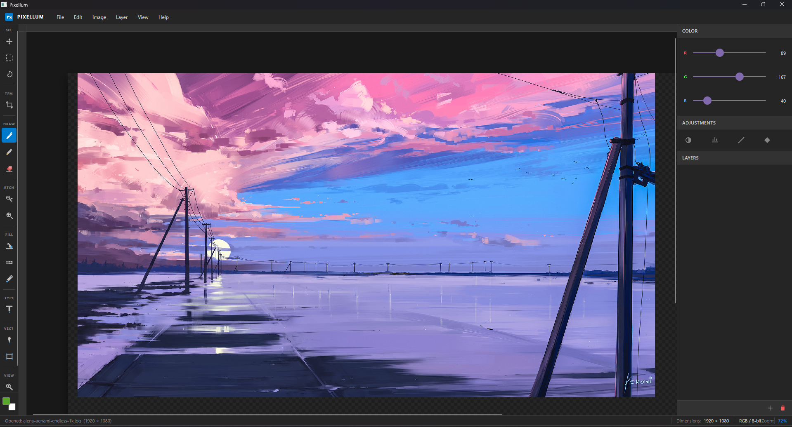
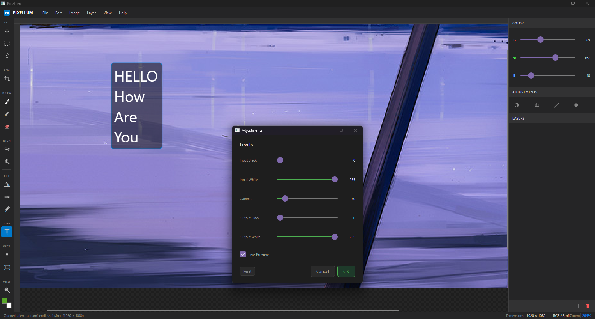
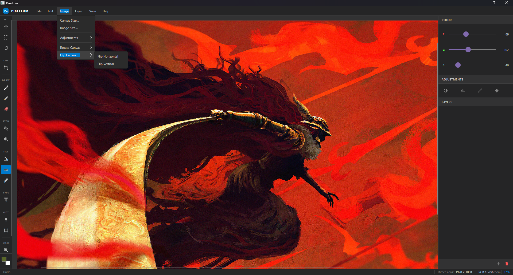

<div align="center">
  <h1>Pixellum</h1>
  <p><strong>A modern desktop image editor built with C# and Avalonia UI.</strong></p>
  <p>
    Layer-based editing, drawing tools, image adjustments, transforms, and PNG export in a clean cross-platform desktop app.
  </p>

  <p>
    
    
    
  </p>
</div>

---

## Preview

<p align="center">
  
  
</p>

<p align="center">
  
</p>

## Overview

Pixellum is a raster image editor designed for a straightforward desktop workflow. It includes essential editing tools, layer controls, image adjustments, canvas transforms, and export support in a native Avalonia-based interface.

## Features

<table>
<tr>
<td width="50%" valign="top">

### Editing

- Brush
- Eraser
- Fill
- Eyedropper
- Select
- Move
- Shape
- Text
- Gradient

</td>
<td width="50%" valign="top">

### Workflow

- Add and duplicate layers
- Delete active layer
- Merge layers down
- Change blend modes
- Undo and redo
- Zoom in, zoom out, and reset
- Toggle canvas grid
- View cursor position and canvas size

</td>
</tr>
<tr>
<td width="50%" valign="top">

### Adjustments

- Brightness and contrast
- Hue and saturation
- Levels
- Curves
- Color balance

</td>
<td width="50%" valign="top">

### Image Operations

- Resize canvas with anchor positioning
- Resample image size
- Rotate 90° clockwise
- Rotate 90° counterclockwise
- Rotate 180°
- Flip horizontally
- Flip vertically

</td>
</tr>
</table>

## File Support

| Action | Supported Formats |
|---|---|
| Open | PNG, JPG, JPEG, BMP, GIF, WebP |
| Save | PNG |
| Export | PNG |

## Tech Stack

- .NET 9.0
- Avalonia 11.3.8
- Avalonia Fluent Theme
- Avalonia ColorPicker

## Project Structure

```text
Pixellum/
├── Core/           # Document model, layers, history, file handling, adjustments
├── Controls/       # Custom controls
├── Rendering/      # Rendering and compositing logic
├── ViewModels/     # View models
├── Views/          # Dialogs and UI views
├── MainWindow.axaml
├── MainWindow.axaml.cs
├── App.axaml
└── Program.cs
```

## Getting Started

### Prerequisites

- .NET 9 SDK

### Run locally

```bash
git clone https://github.com/SmitBdangar/pixellum.git
cd pixellum
dotnet run
```

### Build

```bash
dotnet build
```

### Publish

```bash
dotnet publish -c Release
```

## Contributing

Contributions are welcome through issues and pull requests. For major changes, open an issue first to discuss the proposed update.
